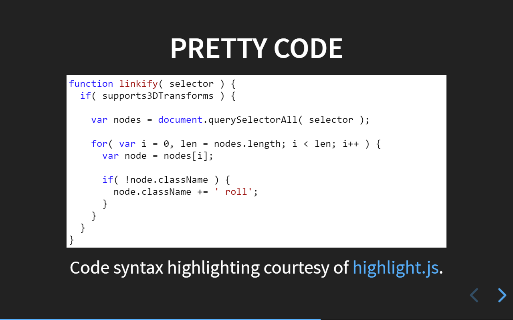
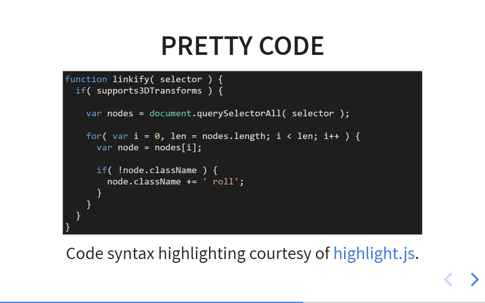

# AltMode

A [reveal.js](https://github.com/hakimel/reveal.js/) plugin to switch between multiple alternative configuartion presets eg. screen and presentation mode, day and night mode, etc. buy pressing a shortcut.






If you are presenting your slide deck you are usually used to handling reveal.js. You want to keep your audience free of all unnecessary visual distration to stay concentrated on what you are presenting.

On the other hand you may want to upload your slides later. Other viewers in front of their computers will then operate your presentation and may not be used to handling reveal.js presentations. In this case you want to give them every available help to navigate thru your slide deck.

Instead of adjusting the configuration for every use case, you can store alternative configurations as ready to use presets and switch between them by pressing a button.

To change themes in alternative presets the [ThemeOverride](https://github.com/McShelby/reveal-themeoverride) plugin or similar is necessary.

## Installation

Copy this repository into the plugins folder of your reveal.js presentation, ie ```plugin/altmode```.

Add the plugin to the dependencies in your presentation, as below.

```javascript
Reveal.initialize({
	// ...
	dependencies: [
		// ...
		{ src: 'plugin/altmode/altmode.js', async: true },
	]
});
```

## Usage

With no further configuration after installation, the plugin will configure one alternative preset for distration free presentation mode.

To switch between alternative presets you can either:

- toggle thru the alternative presets by pressing the ```A``` shortcut on the keyboard
- set the ```altMode``` parameter as a URI parameter
- set the ```altMode``` parameter in your configuration

The URI parameter will override the value of your configuration. By default the default configuration is shown which is equivalent to ```altMode=0```.

### Distraction free presentation mode

This alternative preset removes all unnecessary UI elements from your slide. It is installed if you are not giving any own configuration of alternative presets. It corresponds to the following reveal.js configuration parameters:

```javascript
Reveal.initialize({
	controls: false,
	controlsTutorial: false,
	helpButtonDisplay: 'none', // HelpButton plugin
	hideAddressBar: true,
	history: false,
	mouseWheel: false,
	previewLinks: false,
	progress: false,
	slideNumber: false,
});
```

### Parameter

You can define an unlimited amount of alternative presets in the ```altModeConfig``` parameter of your configuration. You access them with the nummerical ```altMode``` parameter. ```0``` is the default configuration, all other numbers -1 refer to alternative configurations defined in the ```altModeConfig``` parameter.

```javascript
Reveal.initialize({
	// ...

	// Define your alternative presets here. If this parameter is not
	// set, the plugin will install distraction free presentation mode
	// as your only alternative preset.
	// Once the array is defined (even if it is empty), distraction free
	// presentation mode needs to be set manullay. You can add distraction
	// free presentation mode to any configuration preset by setting
	// altModePresenter=true - see below.
	altModeConfig: [
		{
			// distraction free presentation mode
			altModePresenter=true
		},{
			// change transitions in this preset
			backgroundTransition: 'zoom',
			transition: 'zoom',
		}
	]

	// You access your configuration presets with a nummerical value.
	// 0   is the default configuration
	// n-1 is used as an index to access your alternative presets in
	// the altModeConfig array
	altMode: 0,

	// If set to true, the plugin will add distraction free presentation mode
	// to this configuration; by that you can apply distraction free
	// presentation mode to the default configuration as well as to any other
	// configuration of your alternative presets.
	altModePresenter: false,

	// Shortcut for toggling between default configuration and alternative presets
	altModeShortcut: 'A',
});
```


### URI Parameter example

```
http://example.com/demo.html?altMode=1
```

## API

### Javascript

The plugin API is accessible from the global ```AltMode``` object.

```javascript
// Change a config value at runtime
AltMode.configure({
	altMode: 1,
});

// Retrieves an object with the settings for
// distraction free presentation mode
AltMode.getPresenterConfig();
```

## License

[WTFPL licensed](http://www.wtfpl.net/).

Copyright (C) 2018 [Sören Weber](https://github.com/McShelby)
